# 🗺️ Mapeamento de Telas e Mockups — sep-app 16062026

Este documento cataloga de forma estruturada todas as interfaces e mockups visuais mapeados no repositório. O motor de Governança de IA classifica cada elemento conforme as evidências de implementação existentes no projeto.

## 🛡️ Diretrizes de Classification de Interfaces

- **🟩 EVIDÊNCIA REAL**: A interface possui tela/mockup correspondente E arquivo de código/layout associado já implementado no sistema.
- **🟨 INFERÊNCIA VISUAL CONTROLADA**: Interface mapeada de forma preventiva a partir de arquivos do diretório de mockups.
- **🟧 PENDENTE DE VALIDAÇÃO HUMANA**: Imagens encontradas via busca profunda no projeto, carecendo de classificação ou aprovação.

---

## 📋 Catálogo de Interfaces Mapeadas

### 🖼️ Tela: Mockup 01

- **Caminho**: `image/mockups/Mockup_01.png`
- **Classificação de Governança**: **🟨 INFERÊNCIA VISUAL CONTROLADA**
- **Status de Validação**: _Mockup localizado no diretório preferencial. Funcionalidade mapeada e estruturada preventivamente._
- **Mapeamento de Requisitos**:
  - [x] Detecção e classificação semântica pelo Control Center
  - [ ] Homologação de usabilidade (UI/UX)
  - [ ] Implementação de lógica complementar

<i>Mockup: Mockup 01</i>

### 🖼️ Tela: Mockup 02

- **Caminho**: `image/mockups/Mockup_02.png`
- **Classificação de Governança**: **🟨 INFERÊNCIA VISUAL CONTROLADA**
- **Status de Validação**: _Mockup localizado no diretório preferencial. Funcionalidade mapeada e estruturada preventivamente._
- **Mapeamento de Requisitos**:
  - [x] Detecção e classificação semântica pelo Control Center
  - [ ] Homologação de usabilidade (UI/UX)
  - [ ] Implementação de lógica complementar

<i>Mockup: Mockup 02</i>

### 🖼️ Tela: Mockup 03

- **Caminho**: `image/mockups/Mockup_03.png`
- **Classificação de Governança**: **🟨 INFERÊNCIA VISUAL CONTROLADA**
- **Status de Validação**: _Mockup localizado no diretório preferencial. Funcionalidade mapeada e estruturada preventivamente._
- **Mapeamento de Requisitos**:
  - [x] Detecção e classificação semântica pelo Control Center
  - [ ] Homologação de usabilidade (UI/UX)
  - [ ] Implementação de lógica complementar

<i>Mockup: Mockup 03</i>

### 🖼️ Tela: Mockup 04

- **Caminho**: `image/mockups/Mockup_04.png`
- **Classificação de Governança**: **🟨 INFERÊNCIA VISUAL CONTROLADA**
- **Status de Validação**: _Mockup localizado no diretório preferencial. Funcionalidade mapeada e estruturada preventivamente._
- **Mapeamento de Requisitos**:
  - [x] Detecção e classificação semântica pelo Control Center
  - [ ] Homologação de usabilidade (UI/UX)
  - [ ] Implementação de lógica complementar

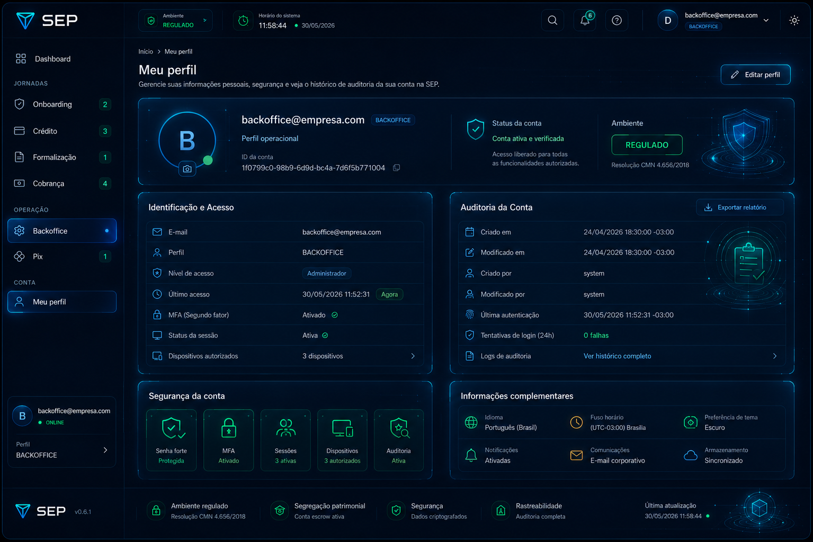
<i>Mockup: Mockup 04</i>

### 🖼️ Tela: Mockup 05

- **Caminho**: `image/mockups/Mockup_05.png`
- **Classificação de Governança**: **🟨 INFERÊNCIA VISUAL CONTROLADA**
- **Status de Validação**: _Mockup localizado no diretório preferencial. Funcionalidade mapeada e estruturada preventivamente._
- **Mapeamento de Requisitos**:
  - [x] Detecção e classificação semântica pelo Control Center
  - [ ] Homologação de usabilidade (UI/UX)
  - [ ] Implementação de lógica complementar

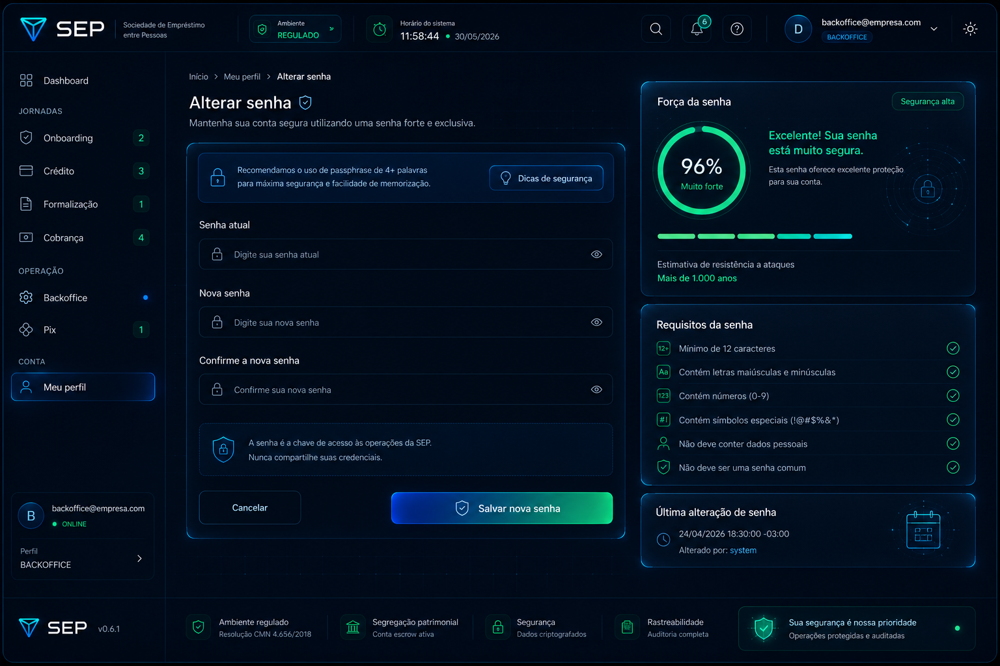
<i>Mockup: Mockup 05</i>

### 🖼️ Tela: Mockup 06

- **Caminho**: `image/mockups/Mockup_06.png`
- **Classificação de Governança**: **🟨 INFERÊNCIA VISUAL CONTROLADA**
- **Status de Validação**: _Mockup localizado no diretório preferencial. Funcionalidade mapeada e estruturada preventivamente._
- **Mapeamento de Requisitos**:
  - [x] Detecção e classificação semântica pelo Control Center
  - [ ] Homologação de usabilidade (UI/UX)
  - [ ] Implementação de lógica complementar

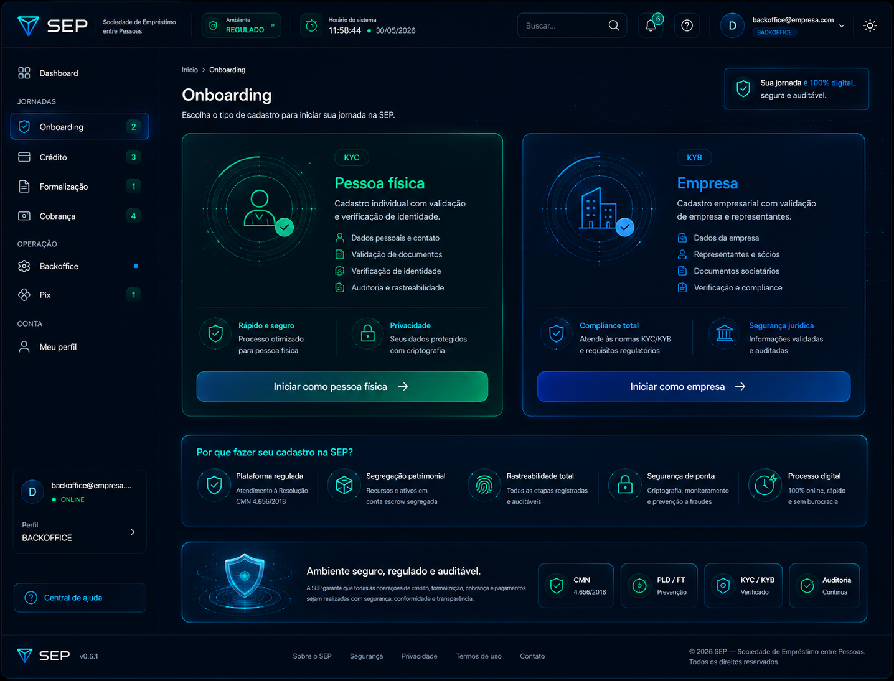
<i>Mockup: Mockup 06</i>

### 🖼️ Tela: Mockup 07

- **Caminho**: `image/mockups/Mockup_07.png`
- **Classificação de Governança**: **🟨 INFERÊNCIA VISUAL CONTROLADA**
- **Status de Validação**: _Mockup localizado no diretório preferencial. Funcionalidade mapeada e estruturada preventivamente._
- **Mapeamento de Requisitos**:
  - [x] Detecção e classificação semântica pelo Control Center
  - [ ] Homologação de usabilidade (UI/UX)
  - [ ] Implementação de lógica complementar

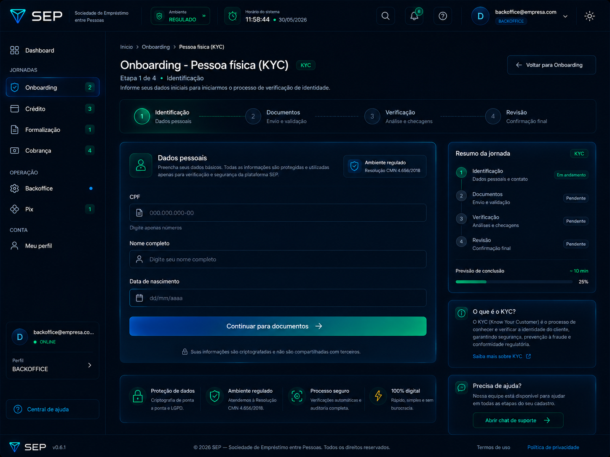
<i>Mockup: Mockup 07</i>

### 🖼️ Tela: Mockup 08

- **Caminho**: `image/mockups/Mockup_08.png`
- **Classificação de Governança**: **🟨 INFERÊNCIA VISUAL CONTROLADA**
- **Status de Validação**: _Mockup localizado no diretório preferencial. Funcionalidade mapeada e estruturada preventivamente._
- **Mapeamento de Requisitos**:
  - [x] Detecção e classificação semântica pelo Control Center
  - [ ] Homologação de usabilidade (UI/UX)
  - [ ] Implementação de lógica complementar

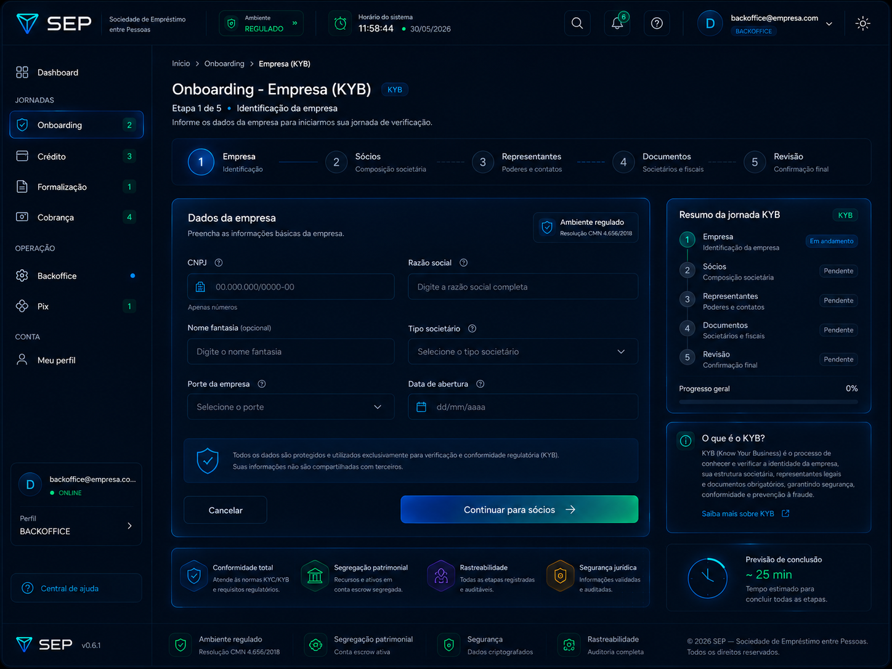
<i>Mockup: Mockup 08</i>

### 🖼️ Tela: Mockup 09

- **Caminho**: `image/mockups/Mockup_09.png`
- **Classificação de Governança**: **🟨 INFERÊNCIA VISUAL CONTROLADA**
- **Status de Validação**: _Mockup localizado no diretório preferencial. Funcionalidade mapeada e estruturada preventivamente._
- **Mapeamento de Requisitos**:
  - [x] Detecção e classificação semântica pelo Control Center
  - [ ] Homologação de usabilidade (UI/UX)
  - [ ] Implementação de lógica complementar

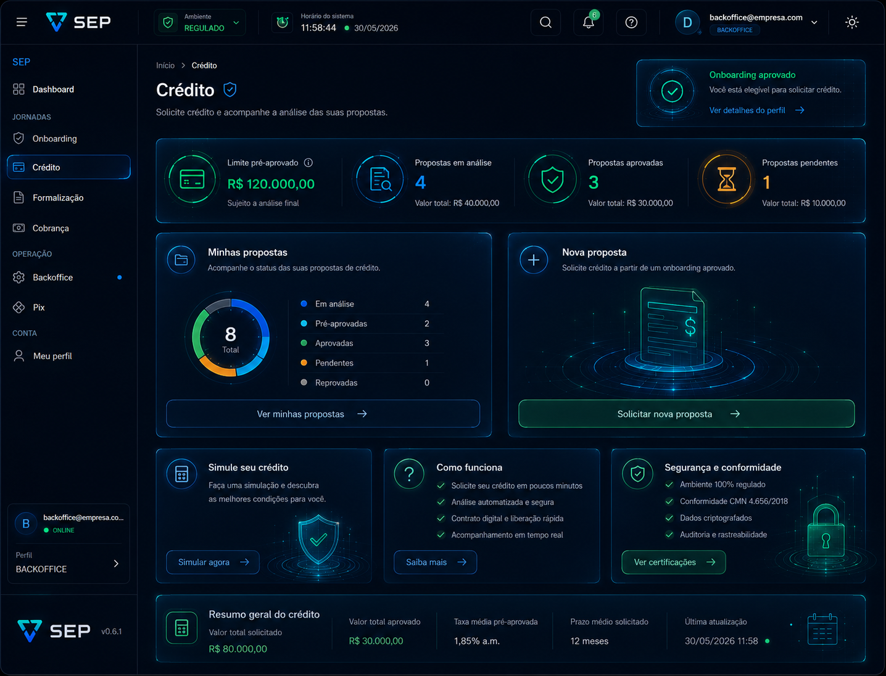
<i>Mockup: Mockup 09</i>

### 🖼️ Tela: Mockup 10

- **Caminho**: `image/mockups/Mockup_10.png`
- **Classificação de Governança**: **🟨 INFERÊNCIA VISUAL CONTROLADA**
- **Status de Validação**: _Mockup localizado no diretório preferencial. Funcionalidade mapeada e estruturada preventivamente._
- **Mapeamento de Requisitos**:
  - [x] Detecção e classificação semântica pelo Control Center
  - [ ] Homologação de usabilidade (UI/UX)
  - [ ] Implementação de lógica complementar

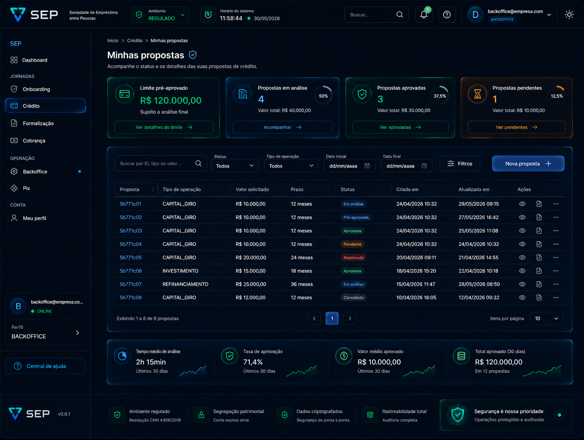
<i>Mockup: Mockup 10</i>

### 🖼️ Tela: Mockup 11

- **Caminho**: `image/mockups/Mockup_11.png`
- **Classificação de Governança**: **🟨 INFERÊNCIA VISUAL CONTROLADA**
- **Status de Validação**: _Mockup localizado no diretório preferencial. Funcionalidade mapeada e estruturada preventivamente._
- **Mapeamento de Requisitos**:
  - [x] Detecção e classificação semântica pelo Control Center
  - [ ] Homologação de usabilidade (UI/UX)
  - [ ] Implementação de lógica complementar

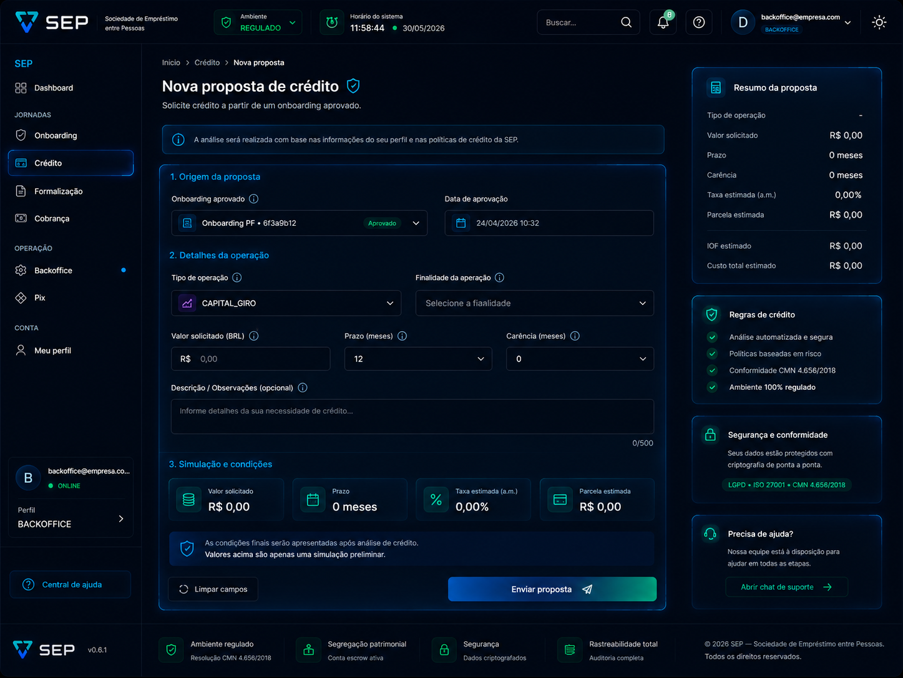
<i>Mockup: Mockup 11</i>

### 🖼️ Tela: Mockup 12

- **Caminho**: `image/mockups/Mockup_12.png`
- **Classificação de Governança**: **🟨 INFERÊNCIA VISUAL CONTROLADA**
- **Status de Validação**: _Mockup localizado no diretório preferencial. Funcionalidade mapeada e estruturada preventivamente._
- **Mapeamento de Requisitos**:
  - [x] Detecção e classificação semântica pelo Control Center
  - [ ] Homologação de usabilidade (UI/UX)
  - [ ] Implementação de lógica complementar

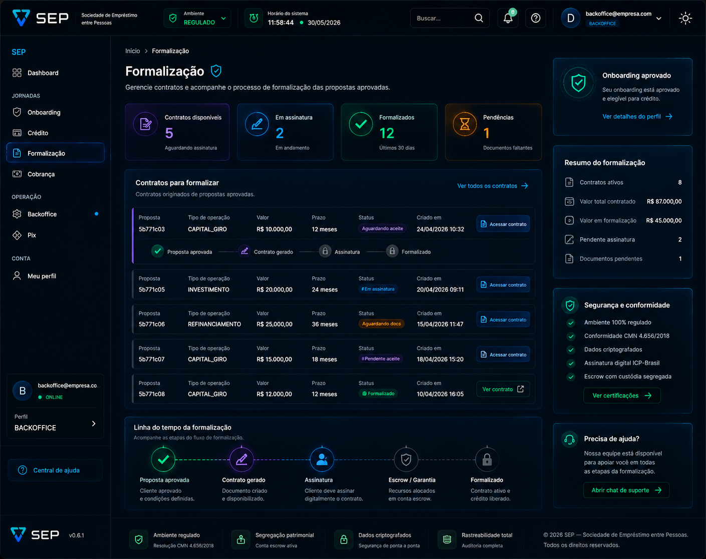
<i>Mockup: Mockup 12</i>

### 🖼️ Tela: Mockup 13

- **Caminho**: `image/mockups/Mockup_13.png`
- **Classificação de Governança**: **🟨 INFERÊNCIA VISUAL CONTROLADA**
- **Status de Validação**: _Mockup localizado no diretório preferencial. Funcionalidade mapeada e estruturada preventivamente._
- **Mapeamento de Requisitos**:
  - [x] Detecção e classificação semântica pelo Control Center
  - [ ] Homologação de usabilidade (UI/UX)
  - [ ] Implementação de lógica complementar

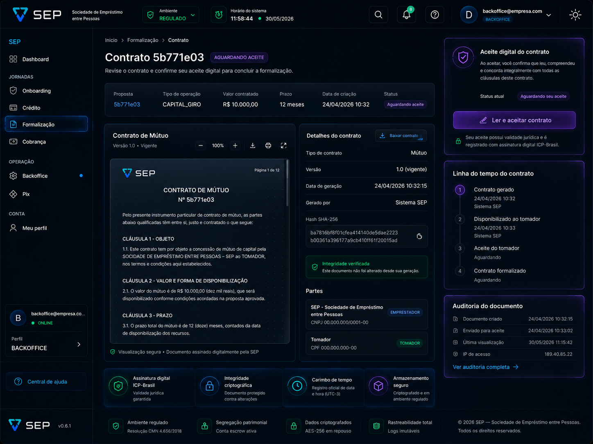
<i>Mockup: Mockup 13</i>

### 🖼️ Tela: Mockup 14

- **Caminho**: `image/mockups/Mockup_14.png`
- **Classificação de Governança**: **🟨 INFERÊNCIA VISUAL CONTROLADA**
- **Status de Validação**: _Mockup localizado no diretório preferencial. Funcionalidade mapeada e estruturada preventivamente._
- **Mapeamento de Requisitos**:
  - [x] Detecção e classificação semântica pelo Control Center
  - [ ] Homologação de usabilidade (UI/UX)
  - [ ] Implementação de lógica complementar

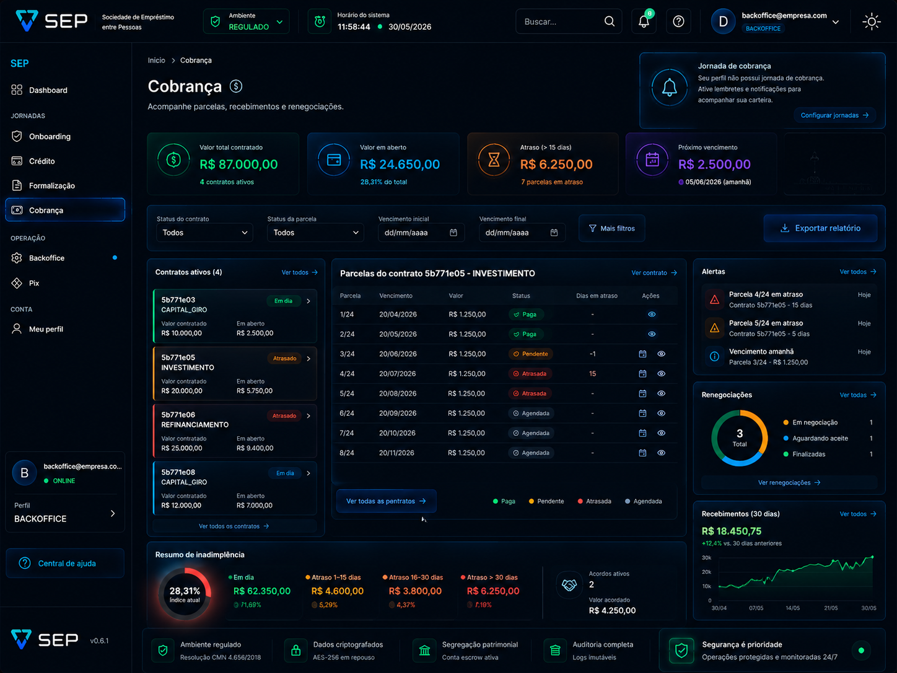
<i>Mockup: Mockup 14</i>

### 🖼️ Tela: Mockup 15

- **Caminho**: `image/mockups/Mockup_15.png`
- **Classificação de Governança**: **🟨 INFERÊNCIA VISUAL CONTROLADA**
- **Status de Validação**: _Mockup localizado no diretório preferencial. Funcionalidade mapeada e estruturada preventivamente._
- **Mapeamento de Requisitos**:
  - [x] Detecção e classificação semântica pelo Control Center
  - [ ] Homologação de usabilidade (UI/UX)
  - [ ] Implementação de lógica complementar

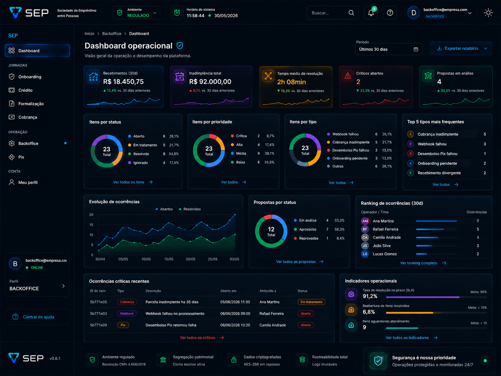
<i>Mockup: Mockup 15</i>

### 🖼️ Tela: Mockup 16

- **Caminho**: `image/mockups/Mockup_16.png`
- **Classificação de Governança**: **🟨 INFERÊNCIA VISUAL CONTROLADA**
- **Status de Validação**: _Mockup localizado no diretório preferencial. Funcionalidade mapeada e estruturada preventivamente._
- **Mapeamento de Requisitos**:
  - [x] Detecção e classificação semântica pelo Control Center
  - [ ] Homologação de usabilidade (UI/UX)
  - [ ] Implementação de lógica complementar

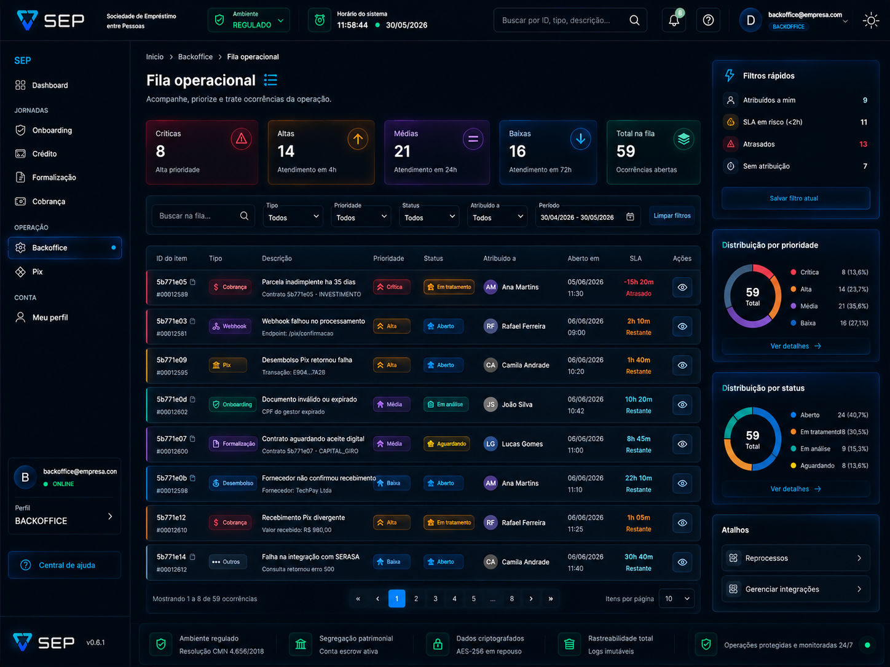
<i>Mockup: Mockup 16</i>

### 🖼️ Tela: Mockup 17

- **Caminho**: `image/mockups/Mockup_17.png`
- **Classificação de Governança**: **🟨 INFERÊNCIA VISUAL CONTROLADA**
- **Status de Validação**: _Mockup localizado no diretório preferencial. Funcionalidade mapeada e estruturada preventivamente._
- **Mapeamento de Requisitos**:
  - [x] Detecção e classificação semântica pelo Control Center
  - [ ] Homologação de usabilidade (UI/UX)
  - [ ] Implementação de lógica complementar

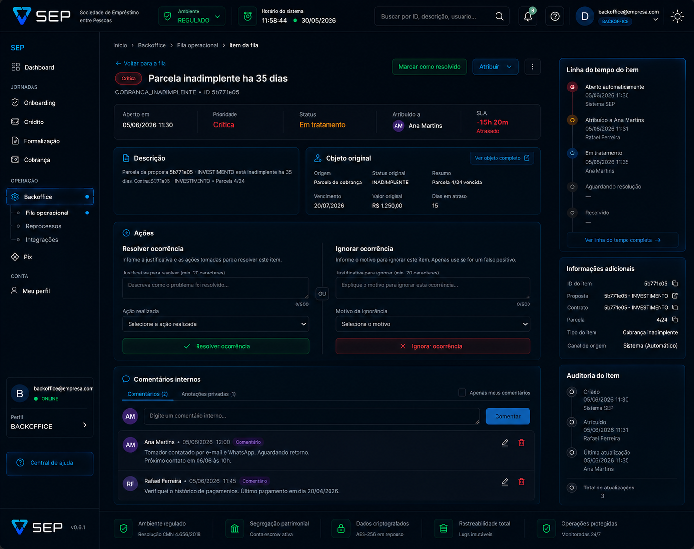
<i>Mockup: Mockup 17</i>

### 🖼️ Tela: Mockup 18

- **Caminho**: `image/mockups/Mockup_18.png`
- **Classificação de Governança**: **🟨 INFERÊNCIA VISUAL CONTROLADA**
- **Status de Validação**: _Mockup localizado no diretório preferencial. Funcionalidade mapeada e estruturada preventivamente._
- **Mapeamento de Requisitos**:
  - [x] Detecção e classificação semântica pelo Control Center
  - [ ] Homologação de usabilidade (UI/UX)
  - [ ] Implementação de lógica complementar

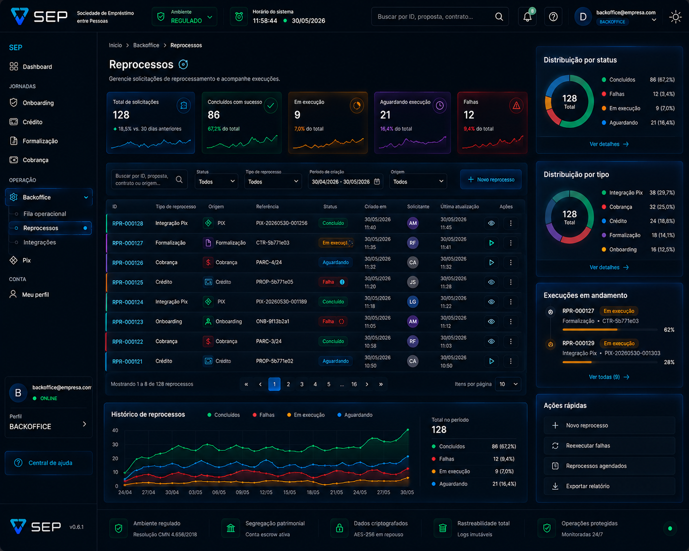
<i>Mockup: Mockup 18</i>

### 🖼️ Tela: Mockup 19

- **Caminho**: `image/mockups/Mockup_19.png`
- **Classificação de Governança**: **🟨 INFERÊNCIA VISUAL CONTROLADA**
- **Status de Validação**: _Mockup localizado no diretório preferencial. Funcionalidade mapeada e estruturada preventivamente._
- **Mapeamento de Requisitos**:
  - [x] Detecção e classificação semântica pelo Control Center
  - [ ] Homologação de usabilidade (UI/UX)
  - [ ] Implementação de lógica complementar

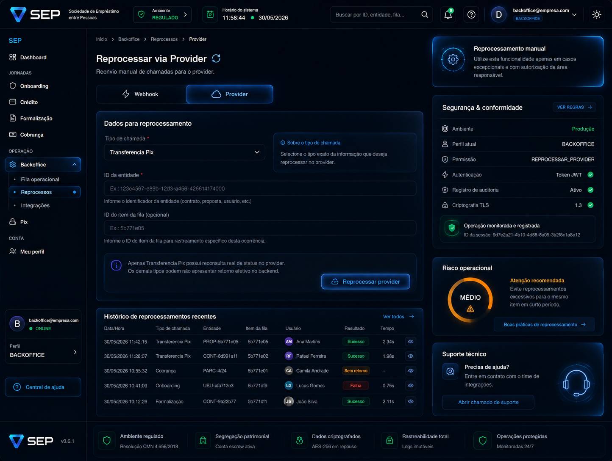
<i>Mockup: Mockup 19</i>

### 🖼️ Tela: Mockup 20

- **Caminho**: `image/mockups/Mockup_20.png`
- **Classificação de Governança**: **🟨 INFERÊNCIA VISUAL CONTROLADA**
- **Status de Validação**: _Mockup localizado no diretório preferencial. Funcionalidade mapeada e estruturada preventivamente._
- **Mapeamento de Requisitos**:
  - [x] Detecção e classificação semântica pelo Control Center
  - [ ] Homologação de usabilidade (UI/UX)
  - [ ] Implementação de lógica complementar

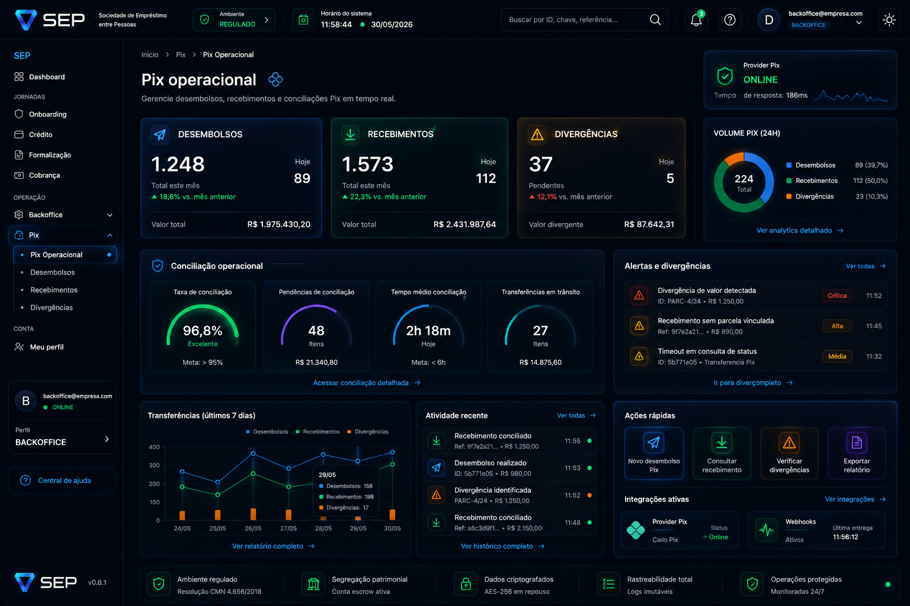
<i>Mockup: Mockup 20</i>

### 🖼️ Tela: Mockup 21

- **Caminho**: `image/mockups/Mockup_21.png`
- **Classificação de Governança**: **🟨 INFERÊNCIA VISUAL CONTROLADA**
- **Status de Validação**: _Mockup localizado no diretório preferencial. Funcionalidade mapeada e estruturada preventivamente._
- **Mapeamento de Requisitos**:
  - [x] Detecção e classificação semântica pelo Control Center
  - [ ] Homologação de usabilidade (UI/UX)
  - [ ] Implementação de lógica complementar

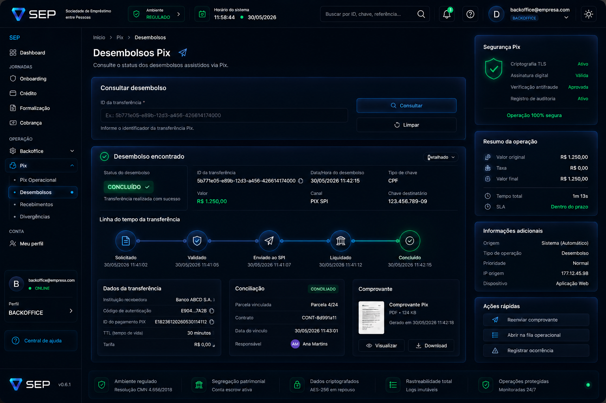
<i>Mockup: Mockup 21</i>

### 🖼️ Tela: Mockup 22

- **Caminho**: `image/mockups/Mockup_22.png`
- **Classificação de Governança**: **🟨 INFERÊNCIA VISUAL CONTROLADA**
- **Status de Validação**: _Mockup localizado no diretório preferencial. Funcionalidade mapeada e estruturada preventivamente._
- **Mapeamento de Requisitos**:
  - [x] Detecção e classificação semântica pelo Control Center
  - [ ] Homologação de usabilidade (UI/UX)
  - [ ] Implementação de lógica complementar

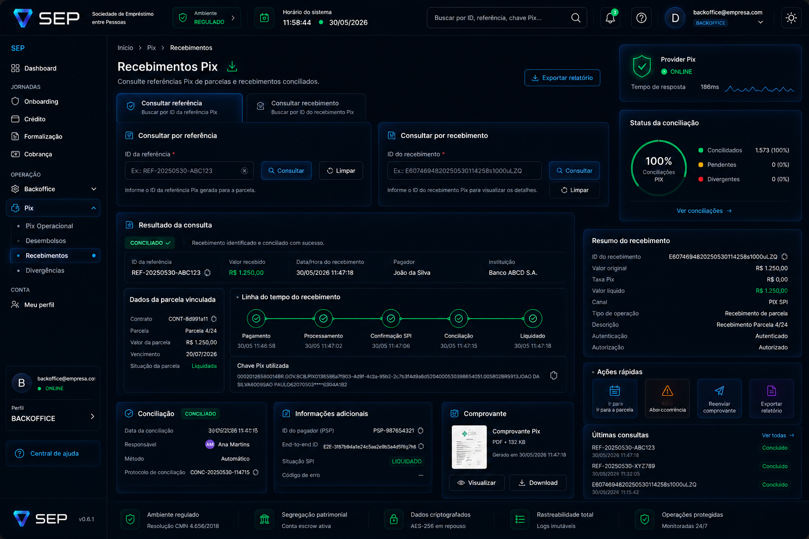
<i>Mockup: Mockup 22</i>

### 🖼️ Tela: Mockup 23

- **Caminho**: `image/mockups/Mockup_23.png`
- **Classificação de Governança**: **🟨 INFERÊNCIA VISUAL CONTROLADA**
- **Status de Validação**: _Mockup localizado no diretório preferencial. Funcionalidade mapeada e estruturada preventivamente._
- **Mapeamento de Requisitos**:
  - [x] Detecção e classificação semântica pelo Control Center
  - [ ] Homologação de usabilidade (UI/UX)
  - [ ] Implementação de lógica complementar

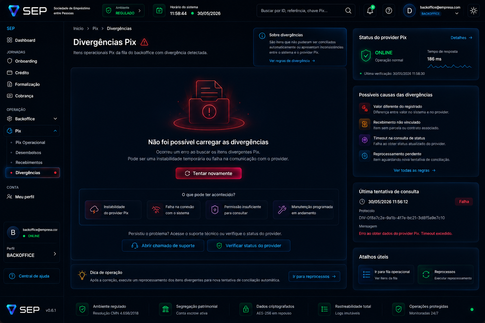
<i>Mockup: Mockup 23</i>

---

<i>Documento gerado de forma autônoma por IA para o sep-app 16062026 — Semantic Docs AI.</i>
