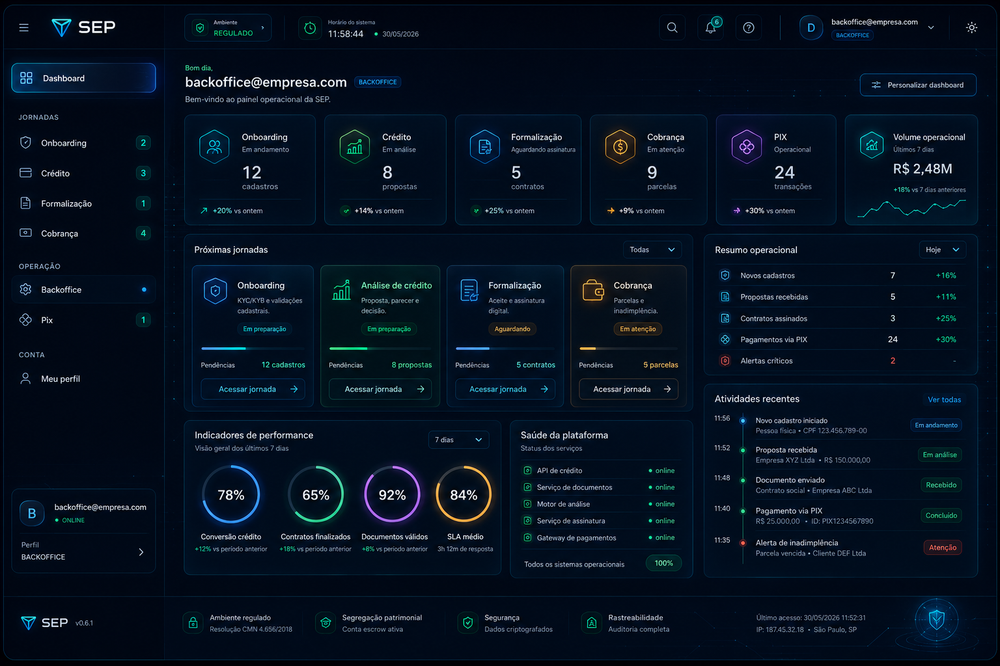

# Detalhamento de Módulo — Mockup 18

## 1. Visão Geral do Módulo

Este documento apresenta a especificação técnica e o detalhamento do módulo **Mockup 18**, integrante crítico do sistema **sep-app 16062026**.

- **Objetivo Estratégico**: Especificação e monitoramento técnico detalhado do módulo Mockup 18.

---

## 2. Especificação Visual e Componentes (Widgets)

Os componentes visuais a seguir foram mapeados e projetados para compor o painel interativo de interface do usuário, assegurando máxima legibilidade sob o tema corporativo do Control Center:

- **`HeaderPanel`**: Cabeçalho de integração rápida de status do módulo.
- **`ViewPort`**: Painel central de exibição das tabelas ou gráficos de monitoramento.
- **`ActionGroup`**: Grade de botões glow para acionamento de rotinas locais.
- **`GlowStatusIndicator`**: LED de pulso neon indicando integridade do módulo.

<i>Esquema Visual: Mockup 03 — Fonte: image/mockups/Mockup_03.png</i>

---

## 3. Fluxos de Dados e Comportamento Lógico

O fluxo operacional e processamento interno dos dados no módulo segue a rotina:

1. O módulo é inicializado dinamicamente com base na seleção do usuário.
2. As informações visuais são consultadas no Semantic Reader e plotadas suavemente.

---

## 4. Governança, Segurança e Regulamentos

Todos os dados trafegados e exibidos por este módulo estão em conformidade com as seguintes diretrizes:

- **Segurança da Malha**: Diretrizes de conformidade documental e governança Dynamis.
- **Trilha de Auditoria**: Registro forense de acessos inalteráveis na base de logs.
- **Controle de Acesso**: Privilégios baseados em papéis (RBAC) ativados para alteração de parâmetros.

---

<i>Documento gerado de forma autônoma por IA para o sep-app 16062026 — Semantic Docs AI.</i>
