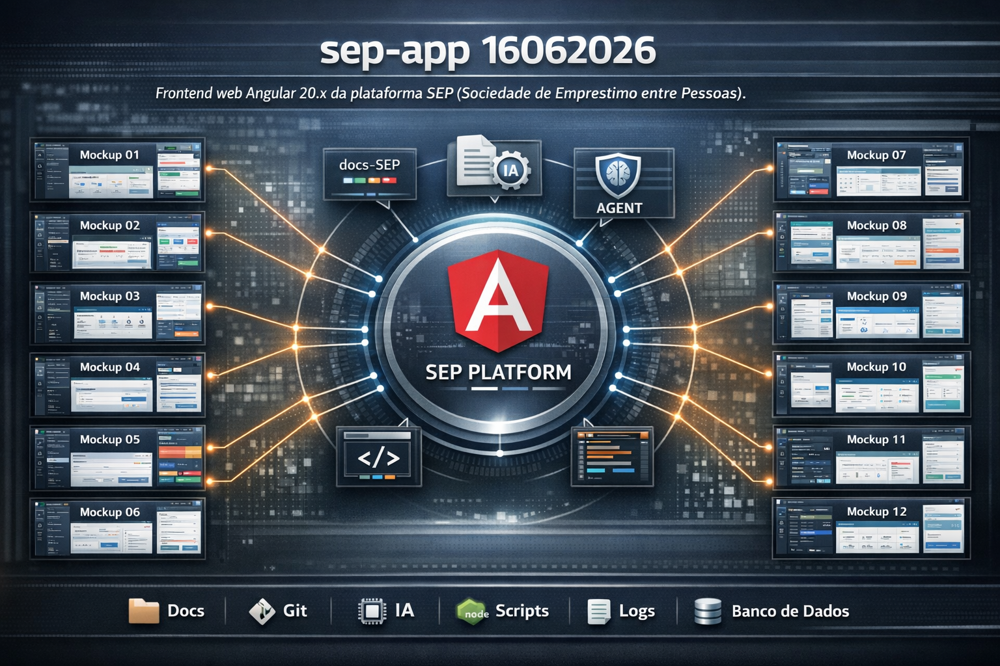
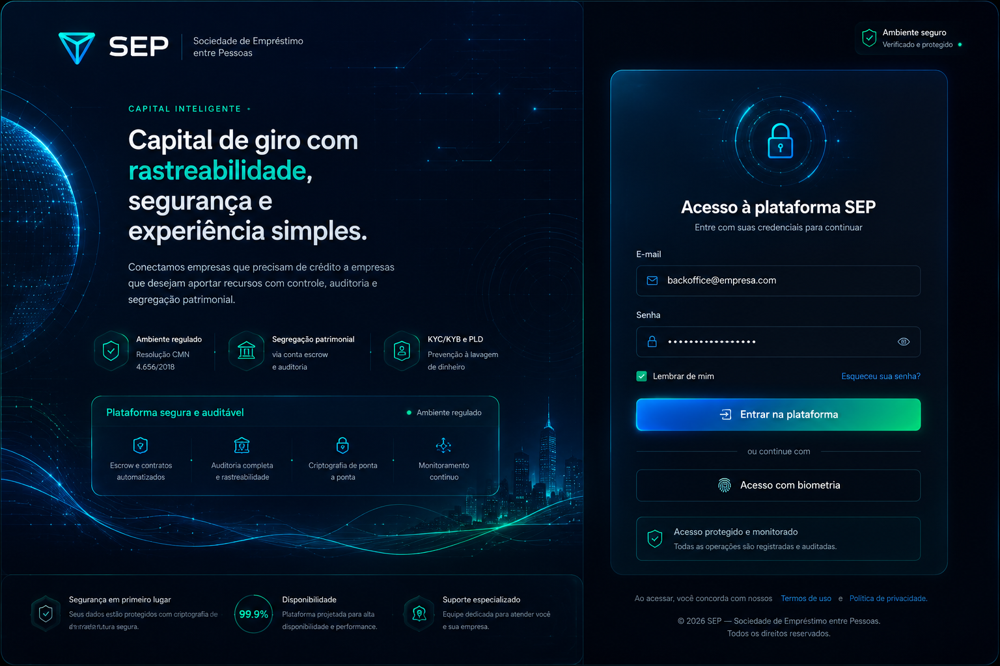

# PRD - Product Requirements Document — sep-app 16062026

## 1. Visão Geral do Produto

O **sep-app 16062026** é concebido como: Frontend web Angular 20.x da plataforma SEP (Sociedade de Emprestimo entre Pessoas).

> Documentacao consolidada do produto vive no repositorio `docs-SEP`:
> PRD, CONTEXT, AGENT.md, ADRs, specs, steps web e docs especificos do web. Ele assegura a conformidade operacional de desenvolvimento na stack **JavaScript/TypeScript** com as dependências chave (**NodeJS package.json, NodeJS package.json, NodeJS package.json**).

## Infográfico Geral

## 2. Requisitos Funcionais (RF)

- **`RF-001` (Integração de Fluxos)**: O sistema deve integrar-se nativamente com as ferramentas corporativas de monitoramento e auditoria em tempo real.
- **`RF-002` (Auditoria de Conformidade)**: Deve gerar relatórios e scores de conformidade de forma não bloqueante a partir da varredura lógica.
- **`RF-003` (Interface de Feedback)**: Deve fornecer indicações claras sobre o status das branches e atividades do sistema.
- **`RF-004` (Trilha de Auditoria)**: Deve manter logs históricos consolidados de execuções de comandos e atualizações.

## 3. Requisitos Não-Funcionais (RNF)

- **`RNF-001` (Performance)**: A indexação e análise das informações técnicas deve ocorrer de forma assíncrona sem afetar a interface principal.
- **`RNF-002` (Segurança)**: Acesso restrito a painéis de configuração privilegiados, com mascaramento visual de dados sensíveis.
- **`RNF-003` (Estilo e Design)**: Interface construída sob a identidade visual premium dark-mode do ecossistema Dynamis.

<i>Interface Mockup 02 — Fonte: image/mockups/Mockup_02.png</i>

## 4. Roadmap de Épicos Técnicos

1. **Épico 1 (Foundation)**: Modelagem e persistência estruturada de dados locais.
2. **Épico 2 (Core Logic)**: Desenvolvimento de lógica operacional baseada em JavaScript/TypeScript.
3. **Épico 3 (Interface)**: Telas operacionais e widgets reativos sob PySide6/Qt.
4. **Épico 4 (Auditoria)**: Auditoria autônoma de conformidade e geração de documentação.

## 5. Métricas de Sucesso

- Score de integridade técnica mantido acima de **90/100**.
- Tempo de resposta para consultas a dados locais inferior a **200ms**.

---

<i>Documento gerado de forma autônoma por IA para o sep-app 16062026 — Semantic Docs AI.</i>
