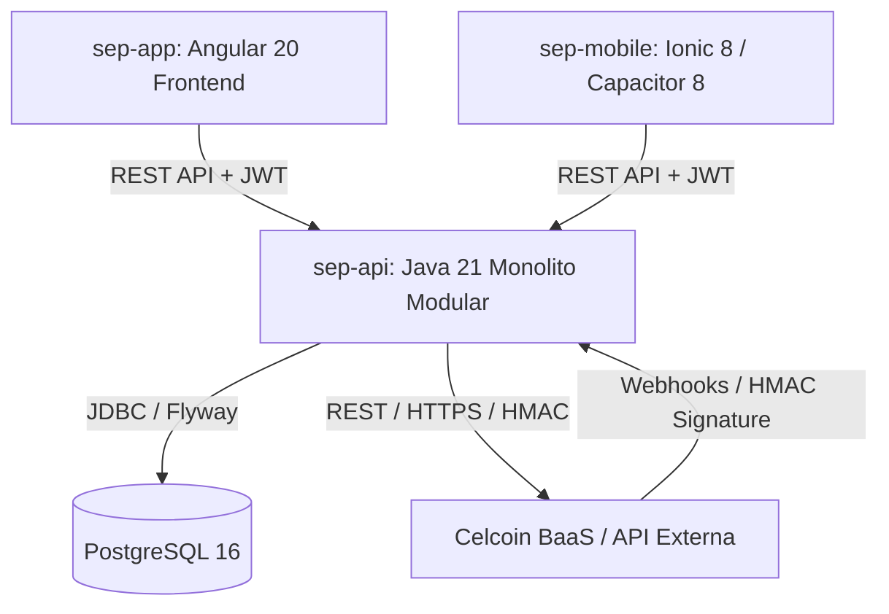

# Documentação de Alinhamento Técnico e de Negócios: Plataforma SEP

Este documento consolida o escopo, arquitetura, infraestrutura, regras de negócio e a estrutura de pastas do projeto **SEP (Sociedade de Empréstimo entre Pessoas)**. O objetivo é servir como guia de alinhamento entre as reestruturações visuais (novos mockups) e o projeto real, permitindo a posterior implementação modular das interfaces.

---

## 1. Visão Geral do Projeto

A plataforma **SEP** é uma fintech de crédito estruturada sob o modelo de **Sociedade de Empréstimo entre Pessoas (Peer-to-Peer Lending)**, com foco inicial em **capital de giro para empresas (PJ)**. A plataforma intermedia a conexão direta entre:

- **Tomadores (PJ):** Empresas que buscam empréstimos de capital de giro.
- **Credores (PJ/Investidores):** Empresas/investidores que aportam recursos financeiros para financiar as propostas.

---

## 2. Marco Regulatório e Regras de Negócio Core

Como uma SEP autorizada, o produto opera sob forte regulação e conformidade com o Banco Central do Brasil.

### Diretrizes Regulatórias (Resolução CMN nº 4.656/2018)

1.  **KYC (Know Your Customer) & KYB (Know Your Business) Obrigatórios:** Nenhum usuário (pessoa física representante ou empresa tomadora/credora) pode operar sem passar por fluxo completo de validação cadastral e envio de documentos.
2.  **Segregação Patrimonial (Conta Escrow/Garantia):** O dinheiro do investidor não se mistura com o caixa da SEP. As movimentações obrigatoriamente passam por contas escrow custodiadas em um banco parceiro (BaaS da Celcoin).
3.  **Prevenção à Lavagem de Dinheiro (PLD):** Consultas obrigatórias automatizadas a bureaus de segurança e listas de restrição (COAF, OFAC, INTERPOL, MTE, etc.) no momento do onboarding.
4.  **Auditoria Operacional:** Toda alteração de perfil de acesso, alteração de parâmetros operacionais ou mutação financeira gera trilha de auditoria no banco de dados (`dataCriacao`, `dataModificacao`, `criadoPor`, `modificadoPor`).

### Regras de Operação e Segurança Tecnológica

- **Segurança com Step-Up (MFA):** Operações críticas que alteram regras do sistema (parâmetros operacionais), aprovam permissões (roles) ou autorizam movimentações de dinheiro (desembolso Pix, renegociações de parcelas) exigem autenticação adicional de segundo fator (MFA/TOTP). O frontend gerencia isso redirecionando para a rota `/app/step-up`.
- **Idempotência Obrigatória:** Requisições financeiras sensíveis (ex: iniciar desembolsos ou registrar recebimentos) exigem o cabeçalho `Idempotency-Key` (UUID temporário gerado no frontend) para evitar que instabilidades de rede causem duplicidade de transações.
- **Armazenamento de Senhas:** Hashes seguros gerados com `BCrypt` com fator de força 10 no backend.

---

## 3. Arquitetura e Infraestrutura de TI

O ecossistema está dividido em três repositórios independentes (`sep-api`, `sep-app` e `sep-mobile`).



### Backend (`sep-api`)

- **Linguagem & Framework:** Java 21 LTS e Spring Boot 3.5.x.
- **Arquitetura:** Monolito Modular orientado a DDD (Domain-Driven Design), utilizando **Ports & Adapters (Arquitetura Hexagonal)** interna em cada módulo de domínio para isolar a regra de negócio de integrações externas.
- **Banco de Dados:** PostgreSQL 16. O controle do schema do banco é gerido pelo **Flyway** (`V1__init.sql`, `V2__...`, etc.).
- **Mapeamento de Dados:** `MapStruct` (type-safe mapper sem reflexão).
- **Integrações Externas:** Isolação via _Provider Pattern_ (ex: `CelcoinProvider` para BaaS e Pix, `FinansystechProvider` para Open Finance). Assinatura de Webhooks recebidos validada com HMAC (SHA-256) em tempo constante.

### Frontend Web (`sep-app`)

- **Framework:** Angular 20.3.x (uso estrito de Standalone Components, Signals e Zoneless nativo).
- **Estilização:** SCSS Puro. Sem frameworks CSS de terceiros (Bootstrap, Tailwind e Material UI estão fora por decisão de arquitetura).
- **Simulador de API (Mocks):** Mock Service Worker (MSW 2.x) integrado ao build de desenvolvimento offline (`dev-offline`) para permitir testes ponta a ponta sem necessidade de backend real de pé.

### Mobile (`sep-mobile`)

- **Stack:** Ionic 8.4+ + Angular 20.3.x + Capacitor 8.3+.
- **Limitação de Escopo:** O aplicativo mobile cobre unicamente as jornadas de **Tomador** (CLIENTE) e **Empresa Credora**. Funções administrativas, backoffice e de financeiro interno são exclusivas da aplicação web.

### Ambientes

1.  **`dev-local`:** Execução local utilizando Docker Compose para PostgreSQL e MSW/Offline para o frontend.
2.  **`aws-develop` (Futuro):** Ambiente de desenvolvimento hospedado na AWS utilizando instâncias Amazon EC2 para os deploys das aplicações e Amazon RDS para banco gerenciado PostgreSQL.

---

## 4. Árvore Estrutural do Projeto

### Estrutura do Backend (`sep-api`)

Organizada em módulos de domínio DDD, isolando as camadas de infraestrutura e controllers web.

```
sep-api/
├── src/main/java/com/dynamis/sep_api/
│   ├── identity/            # Controle de sessões e emissão de JWT
│   ├── usuarios/            # Cadastro e dados cadastrais dos operadores/clientes
│   ├── onboarding/          # KYC/KYB e upload de documentações
│   ├── credito/             # Solicitações, regras de score e pareceres
│   ├── contratos/           # Geração de contratos digitais e CCB
│   ├── cobranca/            # Geração de parcelas, juros, mora e contatos
│   ├── escrow/              # Gestão patrimonial e wallets (CMN 4.656/2018)
│   ├── backoffice/          # Fila operacional para os operadores internos
│   ├── financeiro/          # Fluxos agregados e relatórios internos
│   ├── credores/            # Gestão de investidores e oportunidades
│   ├── pix/                 # Movimentação e conciliação financeira
│   └── shared/              # Utilitários globais, tratamento de erro e segurança
│       ├── domain/
│       ├── application/
│       ├── infrastructure/
│       └── web/
```

### Estrutura do Frontend (`sep-app`)

Organizado seguindo as fronteiras de estado de autenticação e módulos funcionais.

```
sep-app/
├── public/                  # Favicon e mockServiceWorker.js do MSW
├── src/
│   ├── app/
│   │   ├── core/            # Autenticação, interceptadores, guards e services globais
│   │   ├── shared/          # Componentes visuais genéricos (botões, inputs do DS)
│   │   ├── layout/          # Shells estruturais (Public-Shell, Authenticated-Shell)
│   │   ├── features/
│   │   │   ├── public/      # Telas públicas (Landing, Login, Redirect)
│   │   │   └── authenticated/ # Telas logadas por módulo (Dashboard, Crédito, etc.)
│   │   └── app.ts           # Componente raiz
│   ├── mocks/               # Handlers e setups do Mock Service Worker (MSW)
│   └── styles/              # Tokens e mixins do Design System vigente (SCSS)
```

---

## 5. Diretrizes Visuais: O Novo Design System

O projeto passou por uma migração visual (F-Sprint 14) para o **Novo Design System SEP** (derivado do documento `New Design System Sep.md`), que removeu a antiga separação visual entre Apple/Notion.

### Fundamentos do Design System

- **Base de Cores:** Todo o controle de cor é baseado em variáveis HSL (`hsl(var(--token))`), suportando nativamente os modos **Claro (Light)** e **Escuro (Dark)**.
- **Tema:** Gerido via `ThemeService` que aplica ou remove a classe `.dark` no `document` da página e salva a escolha do usuário no `localStorage` como `SEP_THEME`.
- **Cores Semânticas:**
  - `primary`: Azul de comando (ações principais).
  - `success`: Verde (indicadores positivos, pagamentos em dia, contratos ativos).
  - `warning`: Laranja (pendências cadastrais, documentos sob revisão).
  - `destructive`: Vermelho (erros, parcelas vencidas, falhas críticas, transações recusadas).
- **Geometria visual:** Cantos arredondados padronizados em `0.75rem` (12px) nas bordas (`border-radius`) e sombras discretas multicamadas.

---

## 6. Mapeamento de Rotas e Jornadas (Para Alinhamento com Mockups)

Ao planejar os novos mockups visuais das telas, utilize este mapeamento de rotas e perfis correspondentes.

### Telas Públicas (Acesso Geral)

- **Landing Page (`/`):** Apresentação comercial do P2P, simulador de propostas básico (estático) e chamadas para ação.
- **Login (`/login`):** Tela de login tradicional com tratamento visual de erros de credenciais.
- **Redirecionamento de Registro (`/register`):** Direciona o usuário para o onboarding conforme o perfil escolhido.

### Telas do Tomador (Perfil `CLIENTE`)

Jornada voltada para as empresas que tomam o crédito.

- **Dashboard (`/app/dashboard`):** Resumo das propostas ativas, próxima parcela a vencer, gráfico simples de endividamento.
- **Onboarding (`/app/onboarding`):** Entrada de dados adicionais e upload de documentações (RG, CNH, Contrato Social, Comprovantes de Endereço).
- **Crédito/Propostas (`/app/credito/propostas`):**
  - `/nova`: Simulador avançado e formulário de solicitação.
  - `/:id`: Detalhe da proposta exibindo o status, o score calculado e pareceres internos.
  - `/:id/open-finance`: Fluxo de consentimento Open Finance (Handoff externo).
- **Contratos/Formalização (`/app/credito/propostas/:id/formalizacao`):** Visualização da CCB (Cédula de Crédito Bancário) e campo de assinatura digital do contrato.
- **Cobrança/Financeiro (`/app/cobranca/parcelas`):** Agenda de pagamentos da empresa, código Pix copia e cola/QR Code para pagamento.

### Telas de Backoffice Operacional (Perfis `BACKOFFICE` / `FINANCEIRO` / `ADMIN`)

Interface para a equipe interna que analisa propostas, gerencia a mesa de crédito e resolve incidentes.

- **Painel Geral (`/app/backoffice`):** Shell interno de acesso a filas de auditoria.
- **Fila Operacional (`/app/backoffice/fila`):**
  - Lista de tarefas aberta, em tratamento e fechada.
  - `/:id`: Detalhes avançados da oportunidade com aba de comentários internos (auditoria) e botões de ação ("Assumir", "Ignorar", "Aprovar").
- **Painel de Reprocessos (`/app/backoffice/reprocessos`):** Interface para o time financeiro forçar a retentativa de envio/recebimento de webhooks e chamadas para parceiros externos (Celcoin) que tenham falhado por rede.
- **Divergências Pix (`/app/pix/divergencias`):** Fila operacional com transações Pix em que o valor recebido destoa do valor de contrato da parcela.

### Telas de Administração e Governança (Perfil `ADMIN`)

Controles administrativos da plataforma.

- **Controle de Usuários (`/app/admin/users`):** Listagem de membros e configuração cumulativa de permissões (roles) no detalhe (`/app/admin/users/:id`).
- **Parâmetros do Sistema (`/app/admin/parametros`):**
  - Lista e detalhe de chaves operacionais e taxas vigentes da SEP.
  - Permite alteração de valores (exige justificativa textual e dispara fluxo de validação com Step-Up/MFA).

---

## 7. Próximos Passos para o Desenvolvimento

1.  **Refinar os mockups visuais** alinhando os fluxos com a árvore de rotas acima e aplicando a identidade de cores baseada em HSL (Light/Dark).
2.  **Modularizar a implementação do frontend** injetando os componentes estáticos criados nos mockups dentro dos diretórios correspondentes de `src/app/features/authenticated/`.
3.  **Garantir o consumo de serviços** de transporte HTTP que já estão mapeados em `src/app/core/`.
